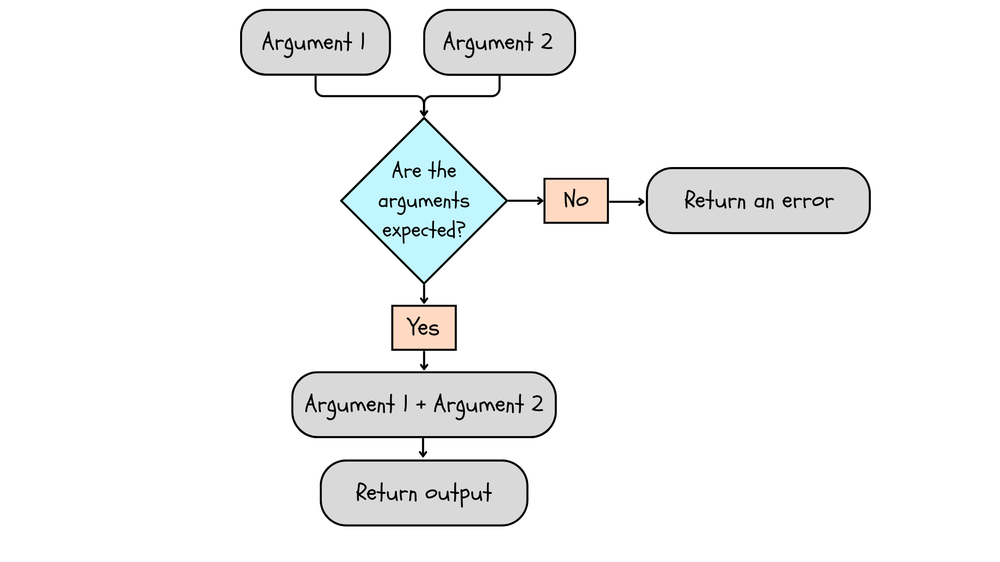
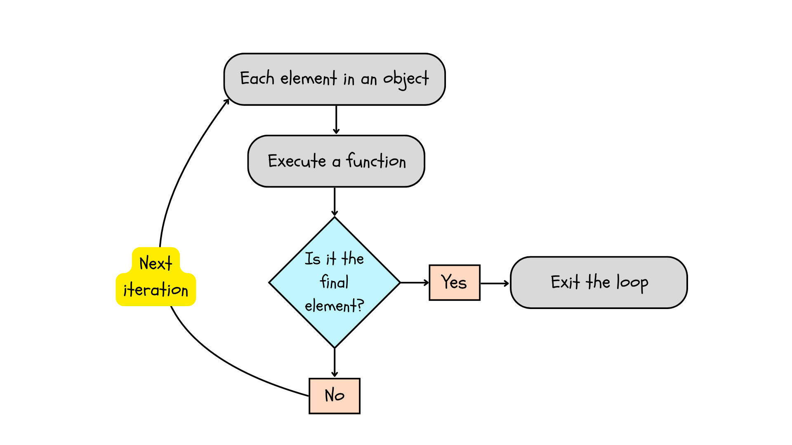

# Writing basic loops and functions

Functions and loops are special object types we can use to perform repetitive operations instead of copying and pasting data. 

*Functions* effectively create a new, insulated environment in our R session that we can use repeatedly by "calling" the function. Any objects we put in this insulated environment get passed through, changed, and come out the other side as a new object type. Even if we change the input object, as long as the object has the correct features, the function will perform the same actions every time. 

So far, we have used several existing R functions to combine data, create data, etc. In R, we almost always apply existing functions to data types and data structures. Some functions are very basic, like those in the previous four chapters, but others are quite complex and incorporate other functions. Often functions also incorporate other functions that incorporate functions.

*Loops* are enclosed environments that are not entirely insulated. We 

Today we are going to learn about the structure of loops and functions, and how they work, by writing some basic loops and functions. These tasks are difficult, but you need to learn how to work with functions and loops before you can explore ecological models.

## Functions

Every function has the same basic structure. **Arguments** are variables we "pass" to the function. The values each time we run the function, which is one of the qualities that makes functions so useful. The **body** of the function contains operations we perform using the arguments. Finally, the **return** tells the function what to give us when the function has run. 

```{r echo = FALSE, fig.cap = "A function takes arguments, checks that the arguments are the type expected, performs a function on the arguments, and returns an output. If the arguments are inappropriate, it returns an error."}

```

You will see that everything contained within the function is separate from your "global environment" (it's contained within the "local environment" of the function), so we need to tell the function what we want to get back from the analysis. Finally, we need an assignment operator to assign the function a name since it is an object. The body and return are enclosed in curly braces, '{}', after the arguments.

```{r, eval = T}
# Here is a basic function that adds 5 to a number we pass
add5 <- function(mySpecialNumber) { # Our single argument
  
  mynewSpecialNumber <- mySpecialNumber + 5 # The body of the function
  return(mynewSpecialNumber) # Return
  
}

# We can call the function, passing any argument we wish
add5(mySpecialNumber = 10)
add5(mySpecialNumber = 3)
```

```{r, eval = F}
# Except when we pass a character!
add5(mySpecialNumber = 'A')
```

What error does R give you when the function expects a numeric, and you give it a character?

```{r}
# We can create functions with multiple arguments
# This function adds another variable x to mySpecialNumber
addx <- function(mySpecialNumber, x) {
  mynewSpecialNumber <- mySpecialNumber + x
  return(mynewSpecialNumber)
}

addx(mySpecialNumber = 10, x = 30)
# We do not need the argument names if we preserve their order
addx(10, 30)

```

Notice how we've assigned an object 'mynewSpecialNumber' in each function, but R  doesn't get confused -- it returns the correct value for each function. This is because the object 'mynewSpecialNumber' is local to the function -- it never ends up in our "global environment". It lives in the function!

What happens when you call the object outside the function? You will likely return an error! This is because the object only exists within the function.

The best way to learn about functions is the help files. In R studio, you can type the name of the function in the search bar under "Help". This will give you the list of arguments within the function.

## For loops

The most common type of loop, for repeating a task twice or more, is the for loop. The most basic example of a for loop is:

```{r}
for (i in 1:3) {
  print(i)
}
```

In this loop, R is *indexing* the object you provided (a numeric vector, `1:3`) and performing a function on each element (`print()`). The loop starts by taking the first element in the object and performing a function. Next, it asks whether this is the last element in the object. If the element is either 1 or 2, this condition is not met, so the loop continues on to the next **iteration**, i.e., performing the same function on the next element and checking its position relative to the end of the object. Finally, when the loop encounters the last element, it performs the function and **breaks** or exits the loop.

```{r echo = FALSE, fig.cap = "A for loop indexes the object, performs a function, checks the position of the element, and exits the loop when it encounters the last element."}

```

We could perform the tasks in this loop manually, but it would take much more time and copy-pasting.

```{r}
i <- 1
print(i)

i <- 2
print(i)

i <- 3
print(i)
```

In most cases, you will want to perform tasks more complex than just printing the elements of a vector. For loops are especially useful for performing repetitive tasks on single elements, then combining the elements into a new object. For example, suppose we wanted to combine two columns from two data frames into a new vector:

```{r}
# Our first data frame, containing genera and families:
family_genus <- data.frame(
  genus = c("Lithobates", "Hyacinthoides", "Oncorhynchus"),
  family = c("Ranidae", "Scilloideae", "Salmonidae")
)

# Our second data frame, containing order and specific epithet:
order_species <- data.frame(
  specific_epithet = c("sylvaticus", "non-scripta", "tshawytscha"),
  order = c("Anura", "Asparagales", "Salmoniformes")
)

# Create an empty character vector with 3 elements
genus_species <- character(length = 3)

# Run the loop for each row in the data frames
for (i in 1:(nrow(family_genus))) {
  genus_species[i] <- paste(family_genus[, 1][i], order_species[, 1][i])
}

genus_species

```