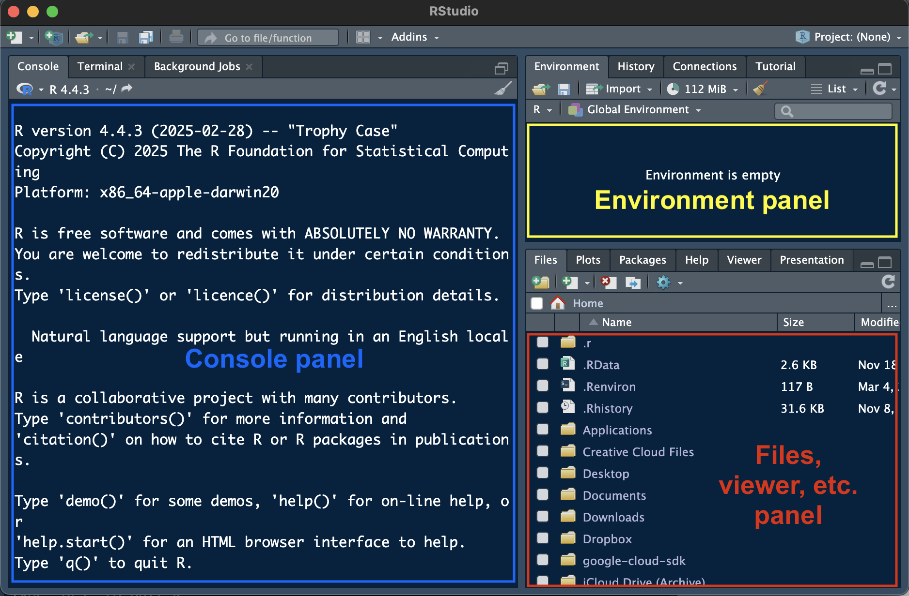
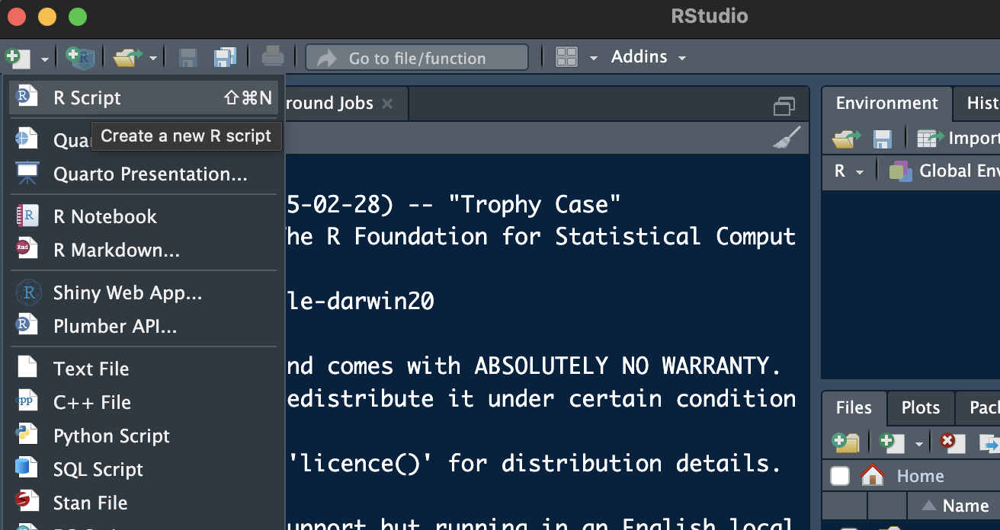
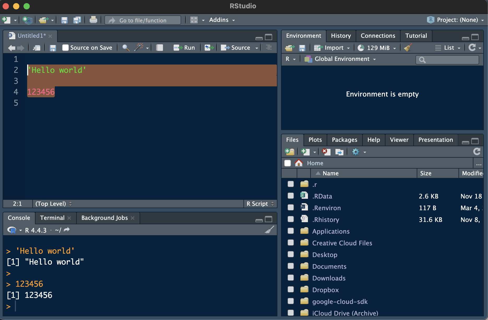
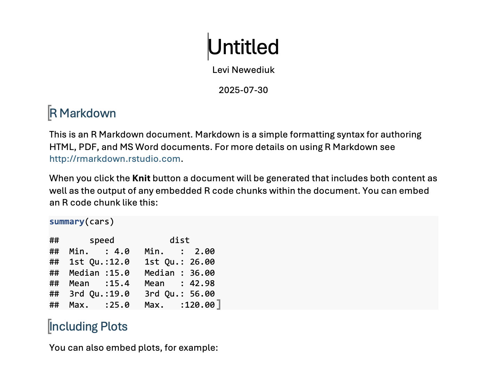
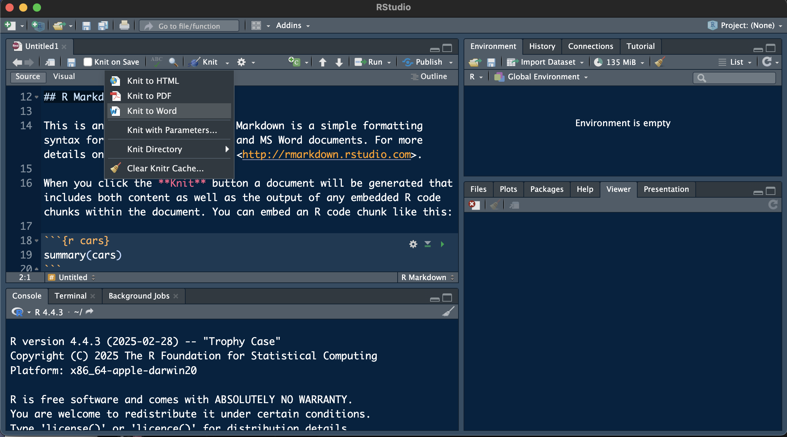
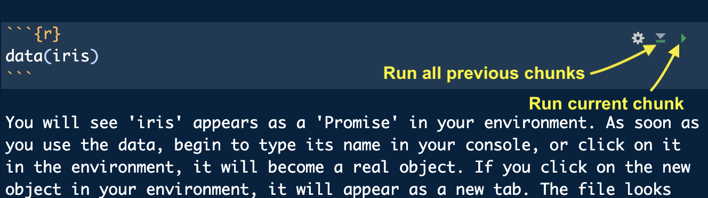

```{r setup, include=FALSE}
knitr::opts_chunk$set(echo = TRUE, out.width = "70%", fig.align = "center")
```

## 1 - Getting started in R

This course is your introduction to programming in R. The exercises we complete together in this course will also serve as a resource in your future if you choose to continue developing your skills in coding and R.

### What is R?

R is a programming language and software environment designed specifically for working with data. Unlike Excel, which is a "point-and-click" software, R lets you write simple commands that tell your computer exactly how to clean, analyze, and visualize your data while keeping notes on your process. This makes your analyses flexible, fully reproducible, and better suited for working with large or complex biological datasets than Excel.

### Why use R?

There are several reasons why we want to teach you to use R instead of Excel.

* **It is widely used by biologists.** Many of the papers you read include analyses and visualizations created in R. Learning R helps you understand how these results were generated and prepares you to generate your own.
* **It is more powerful than Excel.** Real biological datasets are messy, contain missing values, and often very large. Excel doesn't deal well with imperfections and big datasets, but R gives you full control.
* **It makes your work reproducible.** In Excel, it is far too easy to overwrite your existing work or to forget how you did something and have to do it over again. I will show you how to "save" your work so you can easily recreate it when you need to. This also allows others to rerun your analyses and get the same results.
* **It makes beautiful data visualizations.** R allows you to clearly communicate biological patterns in visually stunning ways. You have full control over how data are visualized, not just preset chart options.
* **Learning R will make you more employable.** Even if you don’t become a researcher, using R develops skills that employers value, including problem-solving, data literacy, and the ability to automate repetitive tasks. These skills apply across biology, environmental science, health, etc., and many other fields.

### What will you learn in this course?

We are going to start with some basic tasks to get everyone up to speed with coding before we transition to coding using real data. By the end of this course, you will feel comfortable:

* Identifying the best practices in experimental design & data analyses
* Addressing biological questions with appropriate statistical methodology
* Creating visualizations to display informative patterns in biological datasets
* Analyzing and interpreting biological datasets from open-source repositories
* Interpreting and communicating the results of your analyses
* Manipulating, visualizing, and implementing statistical approaches in R

Always remember that there are *limitless* ways to do almost everything in R. I will show you some approaches I like; other resources can teach you different approaches. Learning the approaches you like will only improve your programming skills in R, so I encourage you to seek out other resources and use them. There are only two basic rules we will follow regarding programming:

1. Always leave detailed notes so I know (and you remember) why you chose the approach you did.
2. If it runs, you get the output you expect, and you can explain your process, your code is correct.


## 2 - Setting up your workspace

First, we want to make sure you have the most recent versions installed of **R** (the software interface to your computer written in the R language) and **RStudio** (a graphical user interface to the R software). If you don't have both programs installed, or you're not sure if you have the most recent versions, please visit the [The Comprehensive R Archive Network (CRAN)](https://cran.r-project.org/) to download or update them.

### Installing or updating R

On the top of the CRAN website, you will see links to download R for macOS and Windows. 

#### Windows

Click on the link to install R for Windows, then click on the *"base"* link. The first link on the next page will be *"Download R-X.X.X for Windows"* (replace "X.X.X" with numbers indicating the most recent version of R). Clicking this link will install the most recent version of R for Windows. Run the program and installation wizard with the default settings. 

If you previously installed an older version of R, downloading the most recent version will overwrite and update it.

#### macOS

Click on the link to install R for macOS, then click on the *"base"* link. There will be two links ending in *".pkg"*. Click on the link corresponding to your mac type (Intel or silicon) to download. Open the installer and install R using the default settings.

### Installing RStudio

We are going to use RStudio in this course as an interface to the program, R, which you just downloaded. If you have used R in the past, you might have written your code in R without using RStudio. We will use RStudio because it make things much easier for you as the programmer. RStudio is a graphical user interface (GUI)---it behaves more like the point-and-click programs you are used to (e.g., Excel). In RStudio, you can save your code in files, which you will need to submit to complete your assignments. RStudio also allows you to preview your code output while you are working on it.

Download RStudio from [https://posit.co/download/rstudio-desktop/](the Posit website). You will see a link to *"Download RStudio Desktop"* for mac or PC. If you scroll further down the page, you will also see links to install RStudio for macOS and Windows. Install RStudio as you did with the program R. If you need to update RStudio, download the new version, and delete the old version if necessary.

When you open RStudio on your computer, it will automatically load with your most recently installed version of R.

## 3 - Using R Studio

When you first open RStudio, you will see a screen something like this:

```{r echo = FALSE, fig.cap = "<center>*Opening RStudio for the first time*</center>"}

```

There are three panes. The largest pane is the **console** window (note that I'm using RStudio in *dark mode*---your RStudio background will likely be white with dark text). The console (left panel) is where you’ll run your R code and see results, and it is what you would see if you just opened the program R without RStudio. The top right panel is your **environment**, where *objects* will store temporarily in R's memory after you run code. The bottom right panel contains several tabs that we will use throughout the course. You will mostly use the **"Files"** and **"Viewer"** tabs. 

The Files tab allows you to interface with the file system on your computer to open files you previously saved in R or downloaded from D2L. You can open a file by finding its location on your computer and clicking on the file. In this course we will be using mostly *scripts* (.R extension) and *R Markdown files* (.Rmd extension). 

### Loading files in R

Up to this point, you have been following along in an R Markdown file previously rendered into a webpage (or pdf) format. At this point, you will need to open the R Markdown file itself.

### **Mini Challenge 1: Open an R Markdown file**

1.  Download the *T01-Intro_to_R.Rmd* file from the Week 1 content on D2L and save it somewhere on your computer.

2.  Locate the directory where you saved the file in the lower right panel of RStudio and click on the file to open it.


#-------------------------------------------------

### Creating a new file in R

In this course, you will need to create scripts and R Markdown files. To create a file, click on the white box with a green (+) in the upper left corner of the console. A dropdown menu will appear. Choose *"R Script"* to create a new script and *"R Markdown"* to create a new R Markdown file.

```{r echo = FALSE, fig.cap = "<center>*Creating a new script file in RStudio*</center>"}

```

When you create a new file, it will appear as a new panel in the upper-left of your RStudio console. You can save the new file by clicking on the "Save" icon in the upper-left corner of the new file---save often! You will need to submit saved files to complete your take-home challenges and project.

### **Mini Challenge 2: Create and save an R script file**

1.  Create a new script file from within R.

2.  Save the file with the name "BIOL_3401_YOUR_NAME_Test.R" somewhere on your computer.


#-------------------------------------------------

### Running basic code

Running code executes the set of instructions in the code you wrote. There are two basic ways to "run" code: 

* Type code directly into your console, directly after the ">" symbol, and press return or enter on your keyboard (note that in this approach, your code will execute then disappear)
* If you are running code from a file, type the code, and use the "Run" icon in the upper-right corner of your file while hovering on the line of code (this approach allows you to save your code in your script or R Markdown file to run again in the future)

```{r echo = FALSE, fig.cap = "<center>*Running code in an R Script*</center>"}

```

You can also highlight several lines of code in a script or R Markdown file and "Run" to run multiple lines of code at once. After running code in a file, you will see it appear in your console.

### Installing packages

R comes with some existing *functions* that help you run code more efficiently. There are *many* functions you can add to R by installing what are called *"packages"*. Packages are containers for functions and other tools that other R users have developed for other R users to use. We will be installing some basic packages to gain access to functions written by others.

Everyone in this course will need to use a package called *"rmarkdown*". To install the package, write the following code in your console and run it:

```{r, eval = F}
install.packages('rmarkdown', dependencies = T)
```

The rmarkdown package is used to read, edit, and preview *R Markdown* files. R Markdown is another interface to R that "renders" text and code you've written into familiar file types like MS Word documents, PDF files, and even webpages. For example, the webpage you are reading now was rendered using R Markdown.

You will see a long read-out of information in the console as the package installs. Once installed, you need to *"attach"* the package by typing and running this code:

```{r, eval = F}
library(rmarkdown)
```

Many students make the mistake of installing packages without attaching them. Except for packages that attach automatically when you open RStudio, you must normally first attach it a package to use its functions. `rmarkdown` is actually one of the exceptions to this rule---it will automatically interface with RStudio after you've installed it. We *did not* need to attach the package, but it's useful as a demonstration. *Later, we will install packages that MUST be attached when we want to use their functions.*

## 4 - Scripts versus R Markdown files

### R Markdown

R Markdown files include a combination of code and plain text. These files also start with something called a YAML header, which you can find at the very beginning of the document surrounded  by dashes. This R Markdown file includes a title, author, and date, which appear at the top of the document when rendered. The rest of the YAML header are rendering instructions.

Any plain text you type appears as regular text in a rendered document. Hashtags tell R Markdown to create a heading. The more hashtags, the smaller the heading becomes. This allows you to create titles, subtitles, etc. 

Asterisks are used to make plain text **bold** and *italic*. 

Special regions called *"code chunks"* allow you to write and execute your code within the rendered document---you will edit these chunks to complete your mini challenges and take-home challenges. Depending on the code chunk, when your document renders, you will see the code itself, the result of executing the code (e.g., a graph), or both. This is an example of something you might see after rendering an R Markdown file:

```{r echo = FALSE, fig.cap = "<center>*An MS Word document rendered from an Rmarkdown file*</center>"}

```

In this case, the result is an MS Word document. You will be knitting your assignments to HTML (i.e., webpage format) and downloading them as PDFs. You can see some headings (from the YAML header), some subheadings (created with hashtags) and a table with some data. The table was printed using a code chunk. 

You can preview your progress while working on an R Markdown file by *"knitting"* it. We are going to knit our most of our documents in MS Word. To knit documents, we will need to install a new package called *"knitr"*.

### **Mini Challenge 3: Install the knitr package**

Install the package "knitr" and then attach it.

Use this code block to code your answers!

```{r}

```


#-------------------------------------------------

```{r, eval = F}
install.packages('knitr', dependencies = T)
```

After you have installed `knitr` and attached the package, you can use it. Click the down-arrow beside the Knit button, which looks like a ball of yarn with a knitting needle, at the top of your script pane. In the drop-down menu, select "Knit to HTML". An HTML document will open in your web browser, displaying your rendered document. When you are happy with your document, you can save it by 'printing' the document from your browser and saving it as a PDF. That PDF (along with your completed Rmd files) are what you'll normally need to submit to complete your assignments. 

```{r echo = FALSE, fig.cap = "<center>*Knitting an Rmarkdown file*</center>"}

```

You can also run code using the arrows at the top right of the code chunk. The grey downward arrow runs everything previous up to the current code chunk. The green arrow pointing to your right runs the code within the current code chunk only. These functions allow you to check how your code is running before you render the entire document.

```{r echo = FALSE, fig.cap = "<center>*Running code chunks*</center>"}

```

### R scripts

R script files are different from R Markdown files. Anything you type in an R Markdown file is *not* considered code unless it is located inside a code chunk. In a script, *anything you write is considered code* and must be written properly to avoid *errors*. 

Hashtags mean something different in a script. Hashtags before text specify headings in the rendered R Markdown document. In a script, hashtags specify *comments*, which are lines that R will disregard when you run your code. Comments allow you to make notes about the code you are writing. They also allow you to bypass code you are still working on and might not want to run. When you insert a hashtag for commenting, the line will also turn a different colour. These comments are extremely important for organization and documentation---we will talk more about this in lesson 2.

## 5 - Loading and saving datasets in R

You will work primarily with familiar spreadsheet-like data in R. You will learn more about data types in lesson 3, but for now let's practice accessing data from outside of R. Base R has several existing datasets you can load and use for practice. One of these datasets is called 'iris', containing 50 observations of flower characteristics from three plant species. These data were first used in a famous 1936 paper by Ronald Fisher.

### Loading data from within R

To load pre-existing data in base R, we use the `data()` function.

```{r}
data(iris)
```

You will see 'iris' appears as a 'Promise' in your environment. As soon as you use the data, begin to type its name in your console, or click on it in the environment, it will become a real object. If you click on the new object in your environment, it will appear as a new tab. The file looks similar to something you might see in Excel.

### Loading external data

External datasets (such as those you will download from D2L) need to be loaded into your global environment using a different set of functions (i.e., not `data()`). Before you load data, however, you need to locate the data file path on your local computer. You can either set your *"working directory"* to the folder containing your data files, or you can copy the path of the file itself when you load the data.

Try loading a dataset from your computer. The file should be in a *csv* format, with the file extension ".csv", which stands for "comma separated values". Each value in the dataset is separated by a comma in basic text outside a program like R. You can open this file type Excel and it will look identical to a spreadsheet, since Excel reads the commas as column separators. However, because the .csv is not a proprietary Microsoft file, R can also read this file type and understands that each comma-separated set of values represents a column in the "spreadsheet". You can also open any basic Excel file and export it as a csv file to make it readable in R. 

The function we will use to load the .csv file is `read.csv()`. First, we need to identify the location of the file on your computer. For now, the file might be in your Downloads folder. We will talk more about data organization in the next lesson!

To copy a file path:

 * **Windows:** Click the Start button and then click Computer. Click to open the location of the desired file/folder, hold down the Shift key and right-click the file/folder. Then select 'Copy as path'.
* **Mac:** Navigate to the desired file/folder in the Finder app. Right-click on the file/folder, and while in the right-click menu, hold down the Option key. Then, select 'Copy as Pathname'

### Setting a working directory

You can use the `setwd()` function to set your directory to the folder containing your files (note: replace the file path within the parentheses below with your own file path!):

```{r, eval = F}
setwd("Users/user....") 
```

Your current working directory appears in the top right corner of your console.

Once you have set a working directory, you can use the `read.csv()` function to load the data from within your working directory. Remember to change "data" to the name of the file. You will also need to assign the dataset a name ("data") using "<-", as shown below, or R will only print it out in your console. We will talk more about this in lesson 3.

```{r, eval = F}
data <- read.csv('.../data.csv')
```

If you end up setting your working directory to the wrong folder, or you would like to change directories, you can always move up to your root directory (one folder at a time) with '..' in the `setwd()` function:

```{r, eval = F}
setwd('..')
```

Or, without setting the working directly, you can copy the full file path into the `read.csv()` function (replace the file path with your local file path):

```{r, eval = F}
data <- read.csv('Users/user ..../data.csv')
```

### **Mini Challenge 4: Load external data**

1.  Download the *dinosaurs.csv* file from the Week 1 content on D2L and save it somewhere on your computer.

2.  Load the the *dinosaurs.csv* dataset by copying the filepath.

3.  Set your working directory to the location of the *dinosaurs.csv* dataset then load the dataset from there, calling the dataset "dino_data".

Use this code block to code your answers!

```{r}

```


#-------------------------------------------------

### Saving your data

Equally important is knowing how to save your dataset when you want to move it **out** of R or between scripts after working with it. There are two important functions for doing so: `write.csv()` and `saveRDS()`. The `write.csv()` function saves the data as a comma-separated file. The `saveRDS()` function saves it as an "R data serialization" file, which is a file type native to R. This file type  is useful for moving datasets between scripts because it is much **smaller** than a comma-separated file, and because it **preserves the data types in your dataset so R can recognize them**.

```{r, eval = F}
write.csv(data, 'data_updated.csv')
saveRDS(data, 'data_updated.rds')
```

See how each function first takes the name of the dataset, followed by a comma, then the name (and optionally, folder path) you want to use for the saved file. Note that the file will automatically save to the location of your current working directory. If you would like it to save to a different location, you will need to add a path before the file name. Or, if you have already set your working directory, it will save there.

```{r, eval = F}
saveRDS(data, 'Users/user ..../NewDirectoryLocation/data_updated.rds')
```

Remember that file paths are relative to your current working directory. If you have already set a working directory, specifying a full file path for saving *might* return an error because you are essentially asking R to look for that file path starting from within the current working directory.

After saving as an RDS file, you will need the `readRDS()` function to load it again.

```{r, eval = F}
updated_data <- readRDS('data_updated.rds')
```

### **Mini Challenge 5: Save the dinosaurs data to a different location**

1.  On your computer, within your current working directory, create a new folder called "data".

2.  Save the *dinosaurs* dataset to the new "data" folder as an Rds file.

Use this code block to code your answers!

```{r}

```


#-------------------------------------------------

You should practice on your own to get comfortable loading and saving data using different approaches!

