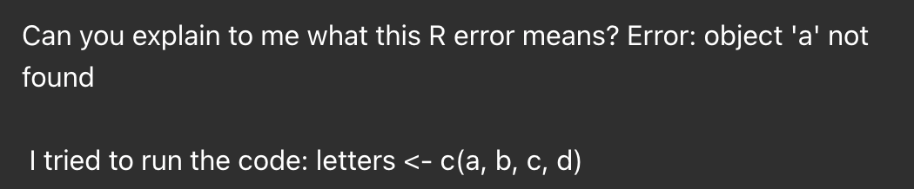
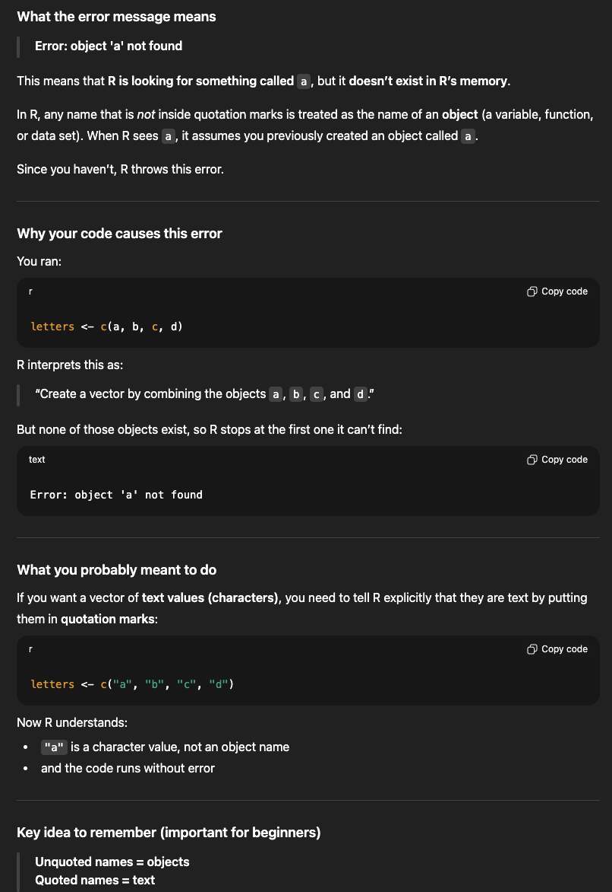

## 1 - Introduction to data types

### Vectors

Let's start by making one of the simplest R objects, a *vector* of numbers. A **numeric** data type is used to store real numbers.

```{r}
vec1 <- c(1, 2, 3, 4, 5)
```

`vec1` is an *object* that we created by using the `<-` operator.

vec1 now contains the output of the *function* `c(1, 2, 3, 4, 5)`, where the `c()` function (c, for **c**ombine) combines elements (1, 2, 3, 4, 5) into a vector.

When you create an object (also called a variable), you'll notice that your environment pane is no longer empty. Just like your dataset showed up when you loaded data, your object `vec1` is now listed as a value in the environment. Here is some information about what this vector contains:

-   "num" to state that it is numerical data
-   "[1:5]" to show that there are five elements in the vector
-   the contents of the vector (1 2 3 4 5)

If we made a vector too large for the environment pane, we could view the whole vector in the console pane using `print()`

```{r}
print(vec1)
```

or you can type the name of the object in the console (or run it from a script) to display the object

```{r}
vec1
```

We can also use the `class` function to get the data type or data structure.

```{r, eval = T}
class(vec1)
```

Let's make a few more objects:

```{r}
x <- 10
y <- 11
letters <- c("a", "b", "c", "d")
```

With the last variable `letters`, we had to use `""` around each letter to specify that we want to create a *character* vector. A **character** data type is used to store text.

### *Mini Challenge 1:*
1. What message do you get from R when you run this code chunk below that doesn't have `""` around the letters?

```{r, eval = FALSE}
letters <- c(a, b, c, d)
```

2. What do you think the message means? Or rather, why do you think you received that message? 

Write your answers below! 


#-------------------------------------------------

## 2 - Troubleshooting your code

### Getting help in RStudio

What if the error message we get from a function doesn't make sense at first glance (this happens much more often than you would imagine!), or what if you want to use a new function that you've never seen before?

R has a built-in help function and very good documentation to describe functions.
To get help for a particular function, you use `?` followed by the function name e.g., `?c` or `?mean`.

If you want to do something in R that you conceptually understand, but don't know what the function is called in R, you can perform a search with `??` e.g., `??mean`

The help search is also built in to the **Files/Plots/Packages/Help/Viewer** pane in RStudio.

Remember, if R gives you an error, you should trust it. R does not make mistakes; it only knows to do exactly what you tell it to do. This means you might be telling it to do something that you didn't intend. When it comes to the letters vector we just tried to make, R thinks that 'a' is the name for an object because you didn't specify it as a character in quotes. There is no variable called 'a' in our environment, so R throws an error.

### Getting help from AI

ChatGPT cannot teach you to code without some prior understanding of what you are doing. It also frequently makes mistakes. However, it is quite good at correcting errors when you're stuck, explaining where you went wrong, and suggesting how you might correct the problem.

Let's imagine we presented ChatGPT with our previous error where we forgot to put '""' around our letters.

```{r echo = FALSE, fig.cap = "<center>*Prompting ChatGPT to explain our vector error*</center>"}

```

Here is ChatGPT's response.

```{r echo = FALSE, fig.cap = "<center>*ChatGPT explains what the error means, why it happened, and what we can do to fix it*</center>"}

```

## 3 - Performing simple operations in R

Back to things that *do* exist in our environment!

Because R looks for objects when performing operations, we can manipulate and change objects as if we're using a calculator:

```{r}
x + 5
x * 2
x
```

R can also handle *vector math* for us without any extra instructions on our part!

```{r}
vec1
vec1 * x
vec2 <- vec1 * x
vec2
```

An important thing to note here is that while `x + 5` returns 15 as the output, and `vec1 * x` returns a whole vector of new values, the values of `x` and `vec1`themselves do not change when we perform these operations. That's because we didn't store the output as a new variable, nor we update `x` or `vec1`.

If we want to update `x`, we need to reassign it.

```{r}
x <- x + 5
x

x <- 10 
xplusfive <- x + 5 
```

An important note about best practices here - you can imagine how easy it would be to overwrite a variable you've been updating and performing functions on. The last thing you want to do is overwrite all your work by accident! This negates one of the most important perks of using R. Even though you are now saving your code in a script or R Markdown file, some functions on large data sets can take a while to run, and having to re-run everything might take an unacceptable amount of time.

*To avoid overwriting your work, always create new variables as you apply functions to your data.*

### **Mini Challenge 3: Vector operations**

1.  Create a new vector called `nums` that contains any 5 numbers you'd like.

2.  Create a new vector called `squares` that contains the elements of `nums` squared (hint: 2^2 = 2 squared).

Use this code block to code your answers!

```{r}

```


#-------------------------------------------------

## 4 - Data frames

So far, we've been talking about atomic vectors, which only contain a single data type (e.g., every element is character or numeric).

Tabular data is a collection of vectors. They can be (but don't have to be) different types, *but all have to have the same length*. An example of tabular data is an Excel sheet. An Excel sheet has one or more columns, typically the same data type, with rows representing separate observations. In R, we'll mostly focus on data frames and tibbles (the tidyverse version of a data frame), particularly as we get into the `tidyverse` way of working in R. 

You'll be looking for data and using data in spreadsheets (which is just a data frame!). We'll be loading your spreadsheets into R to explore, create figures, and analyze the data.

Let's load a data set to play with in R so we can understand how data frames look in R. In our first topic, we loaded the "dinosaurs.csv" dataset as a comma-separated values file. We can load a comma-separated values file using R's basic functionality because it recognizes this file format. However, many people share Excel (xlsx) files, which R doesn't know how to read. One reason is that Excel files can accommodate multiple sheets: one for the dataset, and the other for the metadata. 

To read Excel files, we need to install a new package called `readxl`.

```{r}
install.packages("readxl")
library(readxl)
```

We are going to load an Excel data file containing counts of sheep parasites. The file includes a second sheet with metadata. By default, `read_excel()` only reads in *one* sheet of the spreadsheet. What if we have two sheets? 

```{r}
sheep_parasites <- read_excel("datasets/sheep_parasites.xlsx")
```

... that's not what we want! We need to change the *arguments* in the `read_excel()` function to tell R which sheet to load. 

### **Mini Challenge 4: Getting Help**

1. Look up the `read_excel()` function in the Help pane (or use `?read_excel()`) to figure out which argument determines the sheet you load.

2. Try loading the `sheep_parasites.xlsx` file tabular data, but not the metadata. 


Use this code block to code your answers!

```{r}

```


#-------------------------------------------------

We might encounter different file formats for tabular data, e.g., tab-separated values (tsv) datasets. In comma-separated values (csv) files, each row contains an observation and columns are separated by commas. In tsv files, they are separated by tabs spacing. In reality, both file types are simple text-based files that are easy for computers to understand.

We can load both tsvs and csvs (and other 'text-based' files) with `read.table()`.

```{r}
dinosaurs <- read.table("datasets/dinosaurs.tsv")
```

## 5.
#####*****LAST LESSON WILL BE ON PROPER COMMENTING******######

Include a mini-challenge on commenting a longer section of code with simple operations.
