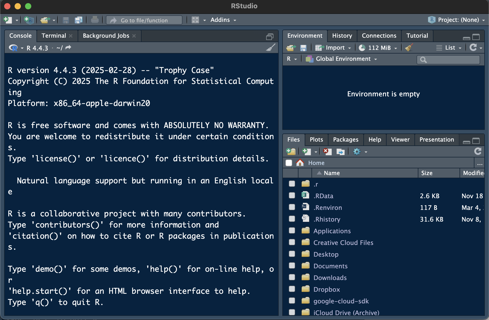
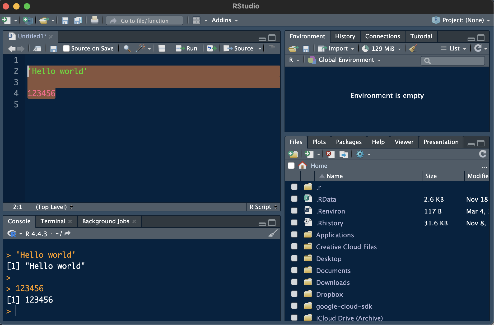

--- 
title: "Ecologist's Introduction to Coding in R"
author: "Levi Newediuk"
date: "`r Sys.Date()`"
site: bookdown::bookdown_site
documentclass: book
bibliography:
- book.bib
- packages.bib
description: |
  ,
link-citations: true
github-repo: "rstudio/bookdown-demo"
---

# Introduction

This book will serve as your introduction to programming in R and a resource you can go back to throughout the course. We are going to perform some basic tasks to get everyone up to speed before we start learning how to work with ecological models.

Throughout this book and throughout the course, I want you to remember that there are *many* ways to do almost everything in R. I will show you some of the ways I like to do things, but there are also *many* other online resources available for you to learn different ways of doing things. Learning what works best for you will only improve your programming skills in R, so I encourage you to seek out other resources and use them. There are only two basic rules we will follow regarding coding:

1. If it runs and you get the output you expect, it is correct.
2. Leave detailed notes so I know (and you remember) why you wrote your code the way you did.

## Getting started

First, we want to make sure you have the most recent versions installed of **R** (an interface to your computer written in the R language) and **RStudio** (a graphical user interface to R). If you don't have both programs installed, or you're not sure if you're working with the most recent versions, please visit the [The Comprehensive R Archive Network (CRAN)](https://cran.r-project.org/) to download or update them.

## Installing or updating R

On the top of the CRAN website, you will see links to download R for macOS and Windows. 

### Windows

Click on the link to install R for Windows, then click on the *"base"* link. The first link on the next page will be *"Download R-X.X.X for Windows"* (replace "X.X.X" with numbers indicating the most recent version of R). Clicking this link will install the most recent version of R for Windows. Run the program and installation wizard with the default settings. 

If you already installed R, downloading the most recent version will overwrite and update your older version of R.

### macOS

Click on the link to install R for macOS, then click on the *"base"* link. There will be two links ending in *".pkg"*. Click on the link corresponding to your mac type (Intel or silicon) to download. Open the installer and install R using the default settings.

## Installing RStudio

We are going to use RStudio in this course as an interface to the program, R, which you just downloaded. In the past, you might have written your code in R without using RStudio. However, RStudio will make things much easier for you. RStudio behaves more like the programs you are used to (e.g., MS Office products); it allows you to save your code in files, which you will need to submit to complete your assignments; and it allows you to preview your code output while you are working on it.

Download RStudio from [https://posit.co/download/rstudio-desktop/](the Posit website). You will see a link to *"Download RStudio Desktop"* for mac or PC. If you scroll further down the page, you will also see links to install RStudio for macOS and Windows. Install RStudio as you did with the program R. If you need to update RStudio, download the new version, and delete the old version if necessary.

When you open RStudio on your computer, it will automatically load an interface to R, which you already installed.

## Using R Studio

When you first open RStudio, you will see a screen something like this:

```{r echo = FALSE, fig.cap = "Opening RStudio for the first time"}

```

There are three panes. The largest pane is a console window (note that I'm using RStudio in *dark mode*---your RStudio background will likely be white). The console is where you’ll run your R code and see results, and it is what you would see if you just opened the program R without RStudio. The top right panel is your environment, where *objects* will store temporarily in R's memory after you run code. The bottom right panel contains several tabs that we will use throughout the course. You will mostly use the *Files* and *"Viewer"* tabs. 

You will view The Files tab allows you to interface with the file system on your computer to open files you previously saved in R: mostly *"scripts"* (.R extension) and *"markdown files"* (.Rmd extension). 

## Creating a new file in R

In this course, you will need to create scripts and markdown files. To create a file, click on the white box with a green (+) in the upper left corner of the console. A dropdown menu will appear. Choose *"R Script"* to create a new script and *"R Markdown"* to create a new markdown file.

```{r echo = FALSE, fig.cap = "Creating a new script file in RStudio"}
knitr::include_graphics("imgs/rstudio_create_script.png")
```

When you create a new file, it will appear as a new panel in the upper-left of your RStudio console. You can save the new file by clicking on the "Save" icon in the upper-left corner of the new file---I encourage you to save often! You will need to submit the saved files to complete your assignments.

## Running code

There are two basic ways to "run" code: 

* Type code directly into your console after the ">" symbol
* If you are running code in a file, type the code, and use the "Run" icon in the upper-right corner of your file while hovering on the line of code

```{r echo = FALSE, fig.cap = "Running code in an R Script"}

```

You can also highlight several lines of code and "Run" to run multiple lines of code at once. After running code in a file, you will see it appear in your console.


