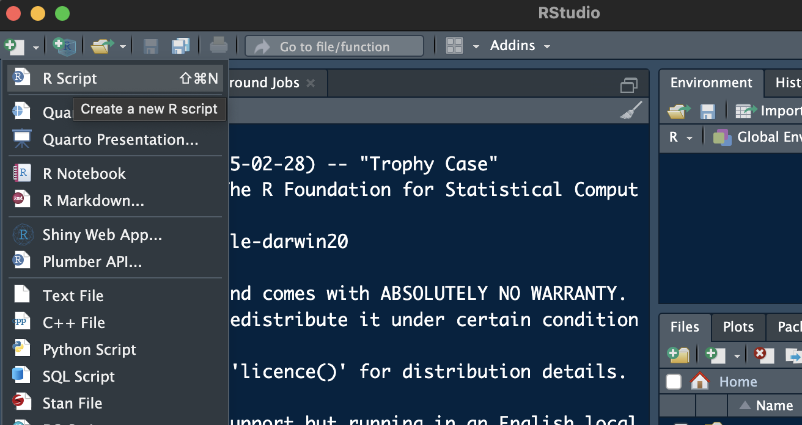

--- 
title: "Ecologist's Introduction to Coding in R"
author: "Levi Newediuk"
date: "`r Sys.Date()`"
site: bookdown::bookdown_site
documentclass: book
bibliography:
- book.bib
- packages.bib
description: |
  ,
link-citations: true
github-repo: "rstudio/bookdown-demo"
---

# Getting started in R

This book is your introduction to programming in R. It's also a resource you can go back to throughout the course. We are going to start with some basic tasks to get everyone up to speed before we start learning how to program ecological models.

Always remember that there are *many* ways to do almost everything in R. I will show you some approaches I like, but *many* other online resources can teach you different approaches. Learning the approaches you like will only improve your programming skills in R, so I encourage you to seek out other resources and use them. There are only two basic rules we will follow regarding programming:

1. If it runs, and you get the output you expect, your code is correct.
2. Always leave detailed notes so I know (and you remember) why you chose the approach you did.

## Setting up your workspace

First, we want to make sure you have the most recent versions installed of **R** (an interface to your computer written in the R language) and **RStudio** (a graphical user interface to R). If you don't have both programs installed, or you're not sure if you have the most recent versions, please visit the [The Comprehensive R Archive Network (CRAN)](https://cran.r-project.org/) to download or update them.

## Installing or updating R

On the top of the CRAN website, you will see links to download R for macOS and Windows. 

### Windows

Click on the link to install R for Windows, then click on the *"base"* link. The first link on the next page will be *"Download R-X.X.X for Windows"* (replace "X.X.X" with numbers indicating the most recent version of R). Clicking this link will install the most recent version of R for Windows. Run the program and installation wizard with the default settings. 

If you previously installed an older version of R, downloading the most recent version will overwrite and update it.

### macOS

Click on the link to install R for macOS, then click on the *"base"* link. There will be two links ending in *".pkg"*. Click on the link corresponding to your mac type (Intel or silicon) to download. Open the installer and install R using the default settings.

## Installing RStudio

We are going to use RStudio in this course as an interface to the program, R, which you just downloaded. In the past, you might have written your code in R without using RStudio. We will use RStudio because it make things much easier for you as the programmer. RStudio is a graphical user interface (GUI)---it behaves more like the programs you are used to (e.g., MS Office products). In RStudio, you can save your code in files, which you will need to submit to complete your assignments. RStudio also allows you to preview your code output while you are working on it.

Download RStudio from [https://posit.co/download/rstudio-desktop/](the Posit website). You will see a link to *"Download RStudio Desktop"* for mac or PC. If you scroll further down the page, you will also see links to install RStudio for macOS and Windows. Install RStudio as you did with the program R. If you need to update RStudio, download the new version, and delete the old version if necessary.

When you open RStudio on your computer, it will automatically load with your most recently installed version of R.

## Using R Studio

When you first open RStudio, you will see a screen something like this:

```{r echo = FALSE, fig.cap = "Opening RStudio for the first time"}

```

There are three panes. The largest pane is a console window (note that I'm using RStudio in *dark mode*---your RStudio background will likely be white with dark text). The console (left panel) is where you’ll run your R code and see results, and it is what you would see if you just opened the program R without RStudio. The top right panel is your environment, where *objects* will store temporarily in R's memory after you run code. The bottom right panel contains several tabs that we will use throughout the course. You will mostly use the *"Files"* and *"Viewer"* tabs. 

You will view The Files tab allows you to interface with the file system on your computer to open files you previously saved in R. You can open a file by finding its location on your computer and clicking on the file. In this course we will be using mostly *scripts* (.R extension) and *markdown files* (.Rmd extension). 

## Creating a new file in R

In this course, you will need to create scripts and markdown files. To create a file, click on the white box with a green (+) in the upper left corner of the console. A dropdown menu will appear. Choose *"R Script"* to create a new script and *"R Markdown"* to create a new markdown file.

```{r echo = FALSE, fig.cap = "Creating a new script file in RStudio"}

```

When you create a new file, it will appear as a new panel in the upper-left of your RStudio console. You can save the new file by clicking on the "Save" icon in the upper-left corner of the new file---save often! You will need to submit saved files to complete your assignments.

## Running code

Running code executes the set of instructions in the code you wrote. There are two basic ways to "run" code: 

* Type code directly into your console, directly after the ">" symbol, and press return or enter on your keyboard
* If you are running code from a file, type the code, and use the "Run" icon in the upper-right corner of your file while hovering on the line of code

```{r echo = FALSE, fig.cap = "Running code in an R Script"}
knitr::include_graphics("imgs/rstudio_run_code.png")
```

You can also highlight several lines of code and "Run" to run multiple lines of code at once. After running code in a file, you will see it appear in your console.

## Installing packages

R comes with some existing *functions* that help you run code more efficiently. There are *many* functions you can add to R by installing what are called *"packages"*. Packages are containers for functions and other tools that other R users have developed for other R users to use. We will be installing some basic packages to gain access to  functions written by others.

Everyone will need two packages in this course. The first is called *"Tidyverse"*. This is actually a group of useful packages with functions that make it easier for you to plot and manipulate data. The second function you are going to install is called *"Rmarkdown"*. You will need this package to read, edit, and preview your assignments, which will be *markdown* files. To install the packages, write the following code in your console and run it:

```{r, eval = F}
install.packages('tidyverse', dependencies = T)
install.packages('rmarkdown', dependencies = T)
```

You will see a long read-out of information in the console as the package installs. Once installed, you can load the package by typing and running this code:

```{r, eval = F}
library(tidyverse)
```

Again, you will see a shorter read-out as Tidyverse loads. This read-out is telling you which packages are a part of the Tidyverse set of packages (dplyr, readr, etc.) and will warn you of "conflicts". These conflicts are not a problem here, and you can ignore them. However, for your future reference, conflicts warn you of functions from loaded packages that share names with functions from the package you just loaded. These conflicting functions may not work as expected because R will not know which package it should use for the function you are calling. If you have conflicts,  you can tell R which package you want to use a function from by running `packageName::function()` (replacing the names of the package and function with the ones you are trying to use).

## Knitting markdown files

You are going to complete your assignments in *markdown* files using *Rmarkdown*. Rmarkdown is another interface to R that "renders" text and code you've written into familiar file types like MS Word documents, PDF files, and even webpages. For example, the webpage you are reading now---i.e., this book---was rendered using Rmarkdown.

Your assignment files will include a combination of code and plain text. Hash tags tell Rmarkdown to create a heading. Asterisks are used to make text bold and italic. Special regions called *"code chunks"* allow you to write and execute your code within the rendered document---you will edit these chunks to complete your assignment. Depending on the code chunk, you will see the code itself, the result of executing the code (e.g., a graph), or both. This is an example of what you might see after rendering an Rmarkdown file:

```{r echo = FALSE, fig.cap = "An MS Word document rendered from an Rmarkdown file"}

```

The result is an MS Word document. You can see some headings and a table with some data. This table was printed using a code chunk. 

As you work on your assignment, you can preview your progress by *"knitting"* it. We are going to knit our assignments in MS Word. To knit your document, click the down-arrow beside the knit button, which looks like a ball of yarn with a knitting needle, at the top of your .Rmd file. In the drop-down menu, select "Knit to Word". An MS Word document will open, displaying your rendered document. When you are happy with your assignment, you can save the word document and submit it.

```{r echo = FALSE, fig.cap = "Knitting an Rmarkdown file"}

```

## Loading datasets in R

The data structure we will be primarily working with is the data frame. You will learn more about data frames in lesson 3, but for now let's practice accessing data from outside of R. Base R has several existing data frames you can load and use for practice. One of these data frames is called 'iris'. It contains 50 observations of flower characteristics from three species. These data were first used in a famous 1936 paper by Ronald Fisher.

To load pre-existing data in base R, we use the `data()` function.

```{r}
data(iris)
```

You will see 'iris' appears as a 'Promise' in your environment. As soon as you use the data frame or begin to type its name in your console it will become a real object. If you click on the new object in your environment, it will appear as a new tab. The file looks similar to something you might see in MS Excel.

External data frames need to be loaded into your global environment using a different set of functions (i.e., not `data()`). Before you load data, however, you need to locate the data file path on your local computer. You can either set your *"working directory"* to the folder containing your data files, or you can copy the path of the file itself when you load the data.

Try loading a dataset from your computer. The file should be in a *csv* format, with the file extension ".csv", which stands for "comma separated values". Each value in the data frame is separated by a comma in basic text outside a program like R. You can open this file type in MS Excel and it will look identical to a spreadsheet, since Excel reads the commas as column separators. However, because the .csv is not a Microsoft file, R can also read this file type and understands that each comma-separated set of values represents a column in a data frame. You can open a basic MS Excel file and export it as a csv file to make it readable in R. 

The function we will use to load the .csv file is `read.csv()`. First, we need to identify the location of the file on your computer.

To copy a file path:

 * **Windows:** Click the Start button and then click Computer. Click to open the location of the desired file/folder, hold down the Shift key and right-click the file/folder. Then select 'Copy as path'.
* **Mac:** Navigate to the desired file/folder in the Finder app. Right-click on the file/folder, and while in the right-click menu, hold down the Option key. Then, select 'Copy as Pathname'

If you wish, you can use the `setwd()` function to set your directory to the folder containing your files for this assignment (note: replace the file path within the parentheses below with your own file path!):

```{r, eval = F}
setwd("Users/user....") 
```

Then, you can use the `read.csv()` function to load the data from within that folder. Remember to change "data" to the name of the file. Also remember to assign the data frame using "<-" or R will only print it out (see Lesson 4.1 [The asssignment operator])!

```{r, eval = F}
data <- read.csv('.../data.csv')
```

If you end up setting your working directory to the wrong folder or you would like to change directories, you can always move up to your root directory (one folder at a time) with '..' in the `setwd()` function:

```{r, eval = F}
setwd('..')
```

Or, without setting the working directly, you can copy the full file path into the `read.csv()` function (replace the file path with your local file path):

```{r, eval = F}
data <- read.csv('Users/user ..../data.csv')
```

Equally important is knowing how to save your data frame when you want to move it **out** of R or between scripts after working with it. There are two important functions for doing so: `write.csv()` and `saveRDS()`. The `write.csv()` function saves the data as a comma-separated file. The `saveRDS()` function saves it as an "R data serialization" file, which is a file type native to R. This file type  is useful for moving data frames between scripts because it is much **smaller** than a comma-separated file, and because it **preserves the data types in your data frame**.

```{r, eval = F}
write.csv(data, 'data_updated.csv')
saveRDS(data, 'data_updated.rds')
```

See how each function first takes the name of the data frame, followed by a column, then the name (and optionally, folder path) you want to use for the saved file. Note that the file will automatically save to the location of your current working directory. If you would like it to save to a different location, you will need to add a path before the file name. Or, if you have already set your working directory, it will save there.

```{r, eval = F}
saveRDS(data, 'Users/user ..../NewDirectoryLocation/data_updated.rds')
```

Remember that file paths are relative to your current working directory. If you have already set a working directory, specifying a full file path for saving might return an error because you are essentially asking R to look for that file path starting from within the current working directory.

After saving as an RDS file, you will need the `readRDS()` function to load it again.

```{r, eval = F}
updated_data <- readRDS('data_updated.rds')
```

You should practice on your own to get comfortable loading and saving data using different approaches!
