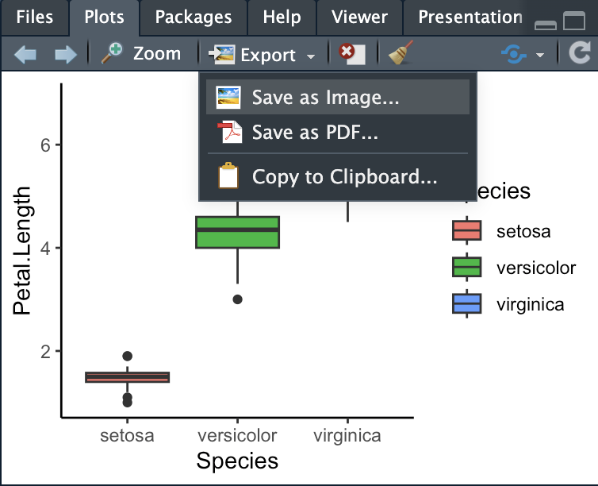

```{r setup, include=FALSE}
knitr::opts_chunk$set(echo = TRUE)
library(tidyverse)
```

## Getting your plots ready for publication

You could easily take an entire course in `ggplot2`, but we only have one week to cover data visualization. This means we can only really scratch the surface of what's possible with ggplot2. In this helper file, I will show you how to save your plots, some tricks for making your plots prettier, and some resources you can look at if you'd like to learn more about plotting in R.

### Resources for your further learning

Here are some resources for you to learn more about `ggplot2` (all are also linked through D2L):

* [The R Graph Gallery](https://www.r-graph-gallery.com/) shows you hundreds of options for graphing your data, along with the code to create the plots
* [The ggplot2 cheatsheet](https://rstudio.github.io/cheatsheets/html/data-visualization.html) is a quick reference for `ggplot2()` aesthetic, `geom()`s, and other formatting options
* [ggplot2: Elegant Graphics for Data Analysis](https://ggplot2-book.org/) is an entire online book if you'd like to take your plotting to the next level

### Advanced plot aesthetics

Let's make two quick plots that we can practice with. We'll load the `iris` dataset and make:

* A boxplot to compare Petal.Lengths between species
* A scatterplot to demonstrate the relationship between Petal.Lengths and Petal.Widths

```{r}
# Load the data
data("iris")

# Make a boxplot
ggplot(iris, aes(x = Species, y = Petal.Length)) +
  geom_boxplot(aes(fill = Species))

# Make a scatterplot with a simple trend line
ggplot(iris, aes(x = Petal.Width, y = Petal.Length)) +
  geom_point(colour = "cornflowerblue") +
  geom_smooth(method = "lm")

```

#### Adjusting colours and fills

We already filled the boxplots by species, but we can customize the colours further. For example, we can also colour the outer edges of the boxes and any outlier points. We can either specify one colour for the outer edges of the boxes, or we can also colour them by species within the aesthetic.

```{r}
# Specify one colour for the outside box edges
ggplot(iris, aes(x = Species, y = Petal.Length)) +
  geom_boxplot(aes(fill = Species), colour = "grey20")

# Colour the boxes by species, within the aesthetic
ggplot(iris, aes(x = Species, y = Petal.Length)) +
  geom_boxplot(aes(fill = Species, colour = Species))
```

When we colour the outsides of the boxes by species, the median line becomes invisible. To see the details inside box, we can adjust the fill so it is slightly transparent. The argument for transparency is `alpha`, which goes *outside of the aesthetic*. `alpha` ranges from zero to one, with 1 = totally opaque and 0 = totally transparent.

```{r}
# Make the fill transparent
ggplot(iris, aes(x = Species, y = Petal.Length)) +
  geom_boxplot(aes(fill = Species, colour = Species),
               alpha = 0.5)
```

#### Adjusting sizes

We can change the sizes of `geoms()` like points and lines. We can set the sizes manually using the `size` and `linewidth` arguments.

```{r}
# Make a scatterplot with a thin trend line and small points
ggplot(iris, aes(x = Petal.Width, y = Petal.Length)) +
  geom_point(colour = "cornflowerblue", size = 0.5) +
  geom_smooth(method = "lm", linewidth = 0.5)
```

We can also adjust the point sizes by some continuous value in the data using `scales()` and moving the `size` argument inside the aesthetic. In this case, we want to use a `continuous` scale function (`scale_size_continuous()`) instead of the `manual` function we used previously.

```{r}
# Make a scatterplot with a thin trend line and small points
ggplot(iris, aes(x = Petal.Width, y = Petal.Length)) +
  geom_point(colour = "cornflowerblue", aes(size = Petal.Width)) +
  geom_smooth(method = "lm", linewidth = 0.5) +
  scale_size_continuous()
```

#### Point and line types

We can also change the appearances of the points and lines. These aesthetics also go *outside of the aes function*.

The argument to change line appearances is `linetype`. Some `linetype` options are:

* "dashed"
* "dotted"
* "dotdash"

The default is "solid".

```{r}
# Make a scatterplot with a dashed linetype
ggplot(iris, aes(x = Petal.Width, y = Petal.Length)) +
  geom_point(colour = "cornflowerblue") +
  geom_smooth(method = "lm", linetype = "dashed") 
```

There are also several options for points. The argument to change the point type is `pch`. The default `pch` = 19 is a circle. Some other options are:

* 15: Square
* 17: Triangle
* 18: Diamond
* 0: Open square
* 1: Open circle

```{r}
# Make a scatterplot with open squares as points
ggplot(iris, aes(x = Petal.Width, y = Petal.Length)) +
  geom_point(colour = "cornflowerblue", pch = 0) +
  geom_smooth(method = "lm") 
```

### Plot themes

So far, all of our plots have the same look: a grey background with white grid lines. We can add `themes()` to our plots to change that look. I will show you some pre-fab themes. You have a huge amount of control over almost every aspect of your plot theme, which we don't have time for. If you are interested in learning more about the possibilities, please check out some of the resources at the beginning of this document.

```{r}
# Box plot with the "classic" theme
ggplot(iris, aes(x = Species, y = Petal.Length)) +
  geom_boxplot(aes(fill = Species)) +
  theme_classic()

# Box plot with the "dark" theme
ggplot(iris, aes(x = Species, y = Petal.Length)) +
  geom_boxplot(aes(fill = Species)) +
  theme_dark()

# Box plot with the "minimal" theme
ggplot(iris, aes(x = Species, y = Petal.Length)) +
  geom_boxplot(aes(fill = Species)) +
  theme_minimal()
```

### Saving your plots

You have a couple of options when it comes to saving your plots. 

#### Option 1: Save your plot manually

Your first option is to save plots manually from the plot viewer in your RStudio panel. To use this approach, you will likely need to print the plot by *copying, pasting, and running the `ggplot2` code from your console.* From here, click the dropdown menu beside "Export" and then "Save as Image...".

You can set the size of the saved plot either by dragging the corner of the plot in the viewer or manually setting the width and height.

```{r echo = FALSE, fig.cap = "<center>*Saving a plot manually in R Studio*</center>"}

```

#### Option 2: Save your plot with `ggsave()`

We can also save plots using code: The `ggsave()` function. To save plots this way, you must have either *saved your plot as an object in your environment*, or your plot must be the *most recent plot you viewed in the plot panel*. You also need to specify the file path where you want to save the plot. 

Some things to note:

* Specify the name of the plot in the `filename` argument, including the file extension. In this example, I'm saving the plot as a .jpg file by specifying `device = "jpg"`. Other `device` possibilities are "png", "tiff", "pdf", etc.
* You must also give the plot a path to the location in your working directory where you'd like to save it. Copy the pathname, as we've done before when loading or saving data, and set it as the `path` argument. Otherwise, the plot will save to your current working directory.
* You can specify the `width` and `height` as arguments in the `ggsave()` function. If you do so, you must also specify the `units`.

This is an example of what it would look like to save a plot from your environment:

```{r eval = FALSE}
# Saving a plot from an object in your environment
ggsave(filename = "petal_plot.jpg", 
       plot = petal_plot, 
       device = "jpg", 
       path = "SET FOLDER PATH HERE",
       width = 10, height = 8,
       units = "cm")
```

If you want to save the most recent plot in your viewer, you can simply change the `plot` argument to `last_plot()`:

```{r eval = FALSE}
# Saving a plot from an object in your environment
ggsave(filename = "petal_plot.jpg", 
       plot = last_plot(), 
       device = "jpg", 
       path = "SET FOLDER PATH HERE",
       width = 10, height = 8,
       units = "cm")
```


